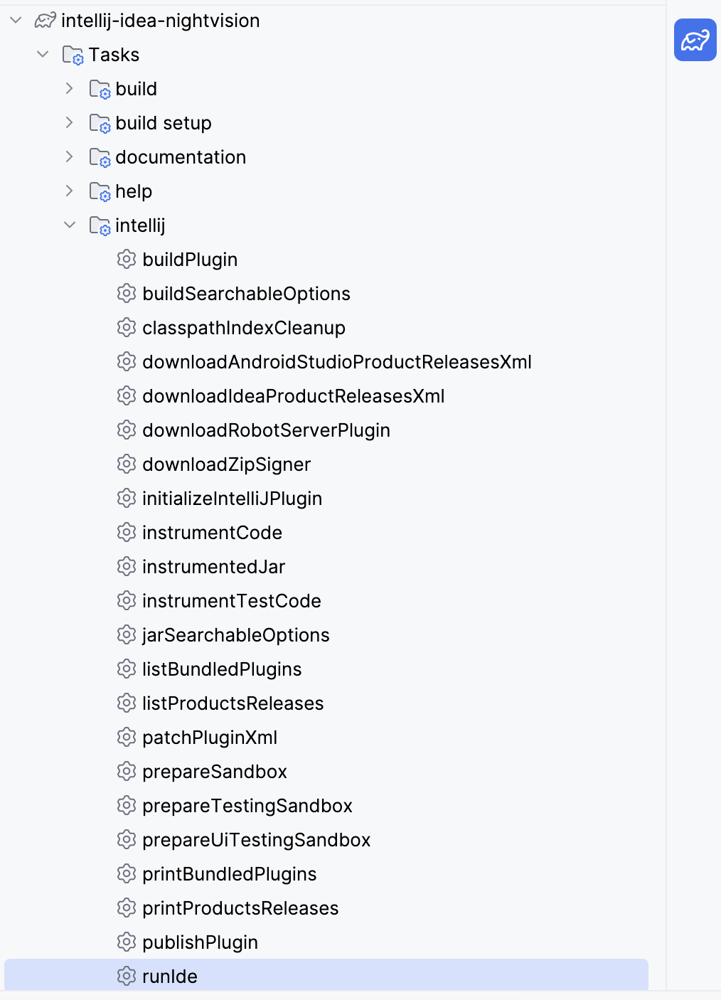
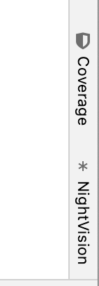
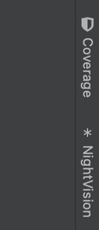
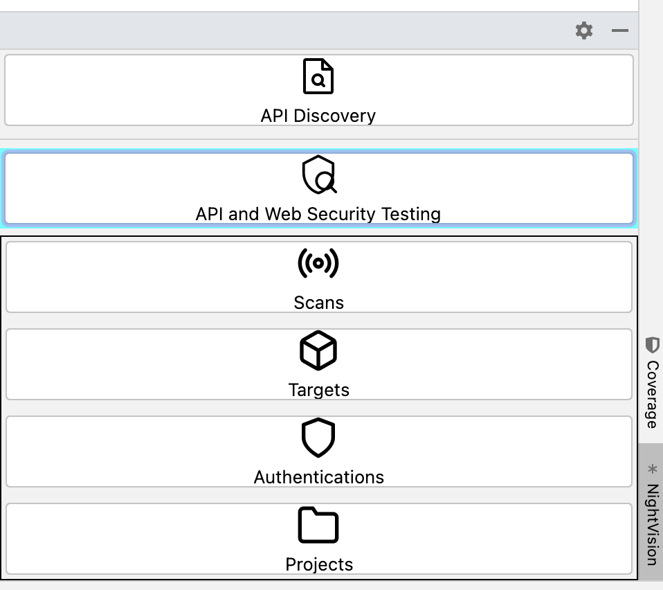

# nightvision-intellij
NightVision plugin for IntelliJ

## Steps to execute (development mode)

1. Click on Gradle's icon on the right side of the screen (usually is there).

2. Select `Tasks` -> `Intellij` -> `runIde`:

  

3. Once a new window of Intellij shows up, select any project to continue.

4. Once viewing a project, you may see `NightVision` on the right side of your IDE:
    - Light theme:
        

        
        

    - Dark theme:
        

        
        

5. If you are not logged in, you will see a button to log in. Once you're logged in, you'll go to the Overview page:

    - Light theme:
        

            
        
