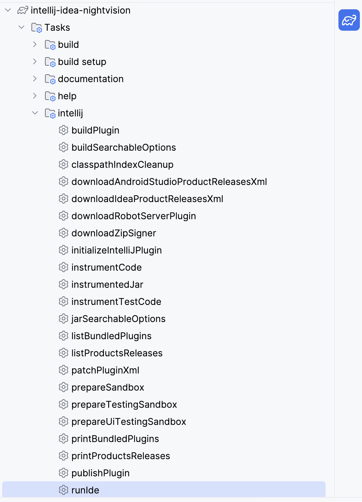
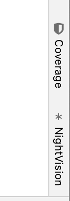
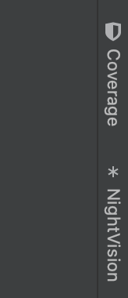
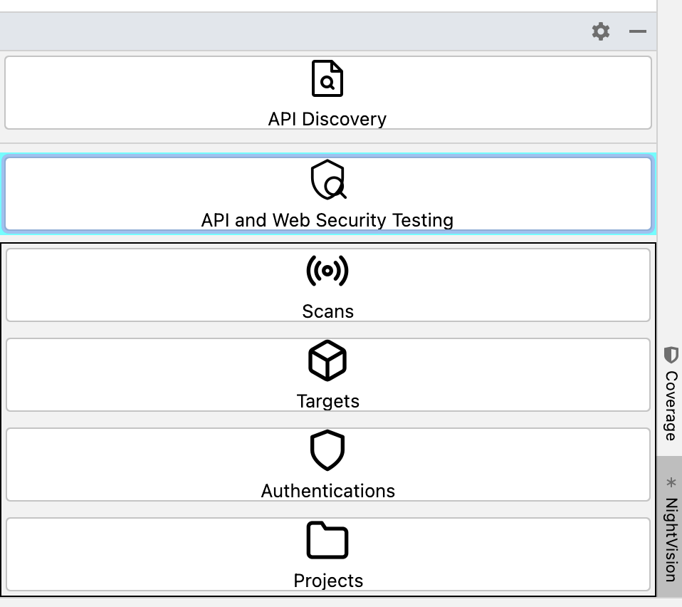

# NightVision IntelliJ Plugin

[NightVision](https://www.nightviz.ai/) plugin for IntelliJ IDEA: document
APIs, run DAST scans, and uncover vulnerabilities in both known and unknown
endpoints.

Install it from the
[JetBrains Marketplace](https://plugins.jetbrains.com/plugin/26915-nightvision).

## Requirements

- IntelliJ IDEA 2023.3 or newer (Community or Ultimate)
- A NightVision account
- The NightVision CLI: the plugin offers to install it, or you can
  [install it manually](https://docs.nightviz.ai/welcome/tutorials-and-guides/installing-the-cli/)

The plugin is a UI over the NightVision CLI; API discovery and scan
operations are delegated to it. Support: support@nightviz.ai.

## Running in development mode

JDK 17 is required to build.

1. Run `make dev` (or `./gradlew runIde`). Alternatively, use the Gradle tool
   window: `Tasks` -> `intellij` -> `runIde`:

  

2. A sandbox IDE opens with the plugin installed. Open any project to
   continue.

3. Once viewing a project, look for `NightVision` on the right side of the
   IDE:
    - Light theme:
        

        
        

    - Dark theme:
        

        
        

4. If the CLI is not yet authenticated you will see a Login button; once
   logged in you land on the Overview page:

  

## Development tasks

| Command        | Purpose                                              |
| -------------- | ---------------------------------------------------- |
| `make build`   | Compile and run the test suite (`./gradlew build`)   |
| `make dev`     | Launch a sandbox IDE with the plugin installed       |
| `make test`    | Build plus plugin verification                       |
| `make verify`  | Run the IntelliJ Plugin Verifier                     |
| `make package` | Build the distributable `.zip` (`./gradlew buildPlugin`) |
| `make clean`   | Delete build outputs                                 |

See [docs/testing.md](./docs/testing.md) for the manual test checklist and
[.agents/skills/release-process.md](./.agents/skills/release-process.md) for
the release process.
